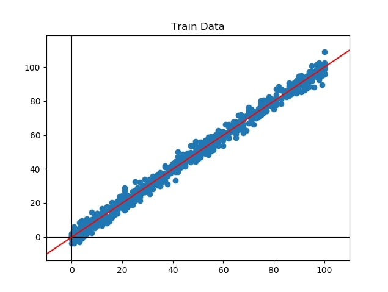
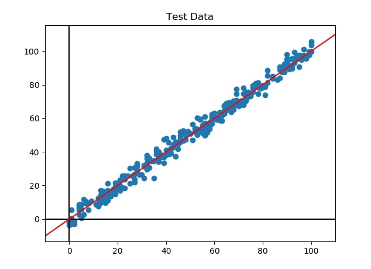

# Task 1 - Simple Linear Regression 
###### @BLITZKMV/Machine-learning-Club

- #### Calculation Results
| Property | Value |
| --- | --- |
| Slope |  1.0007782463113866 |
| Intercept | -0.12015980978207352 |
| Train Accuracy | 86.48867618120377 |

- #### Graphs

  - Regression plotted against train data from train.csv

  - Regression plotted against test data from test.csv

